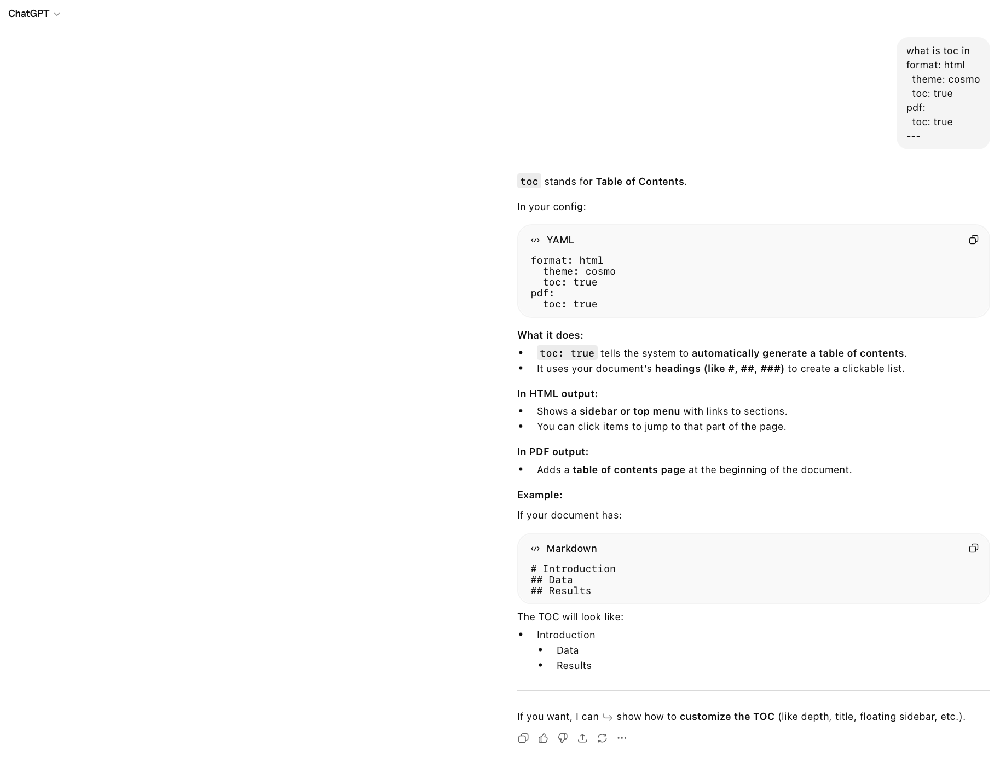
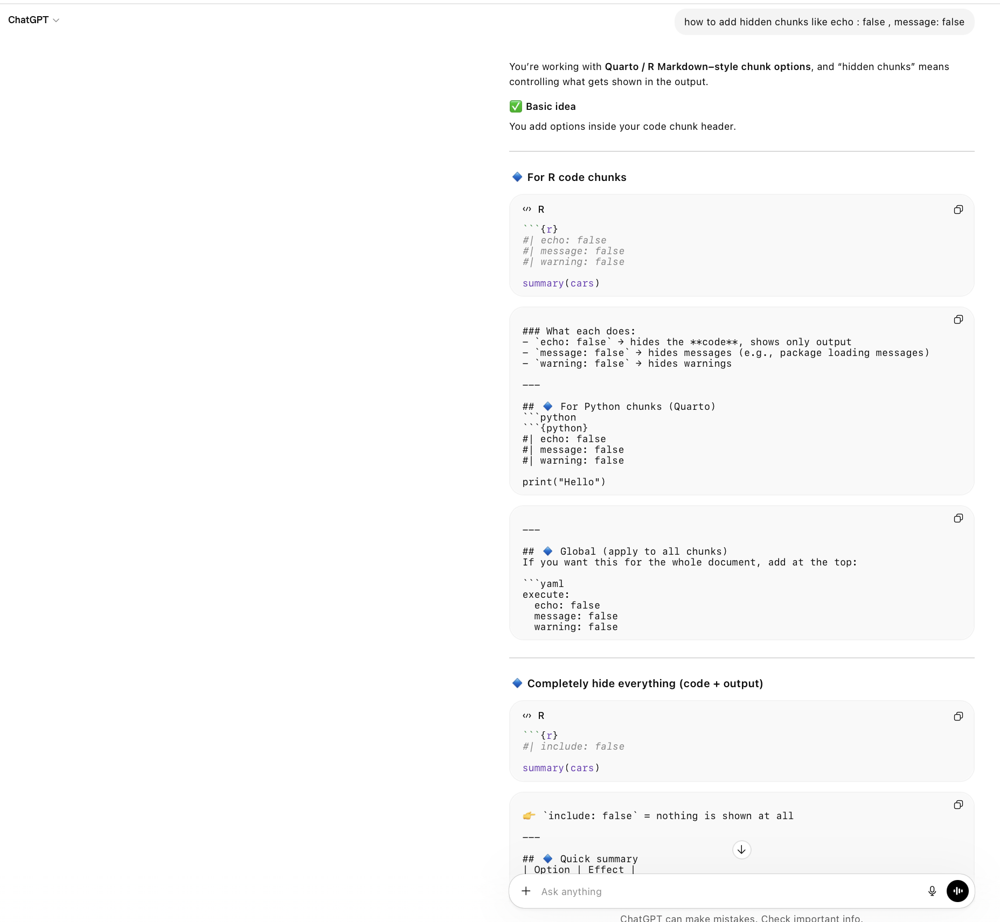
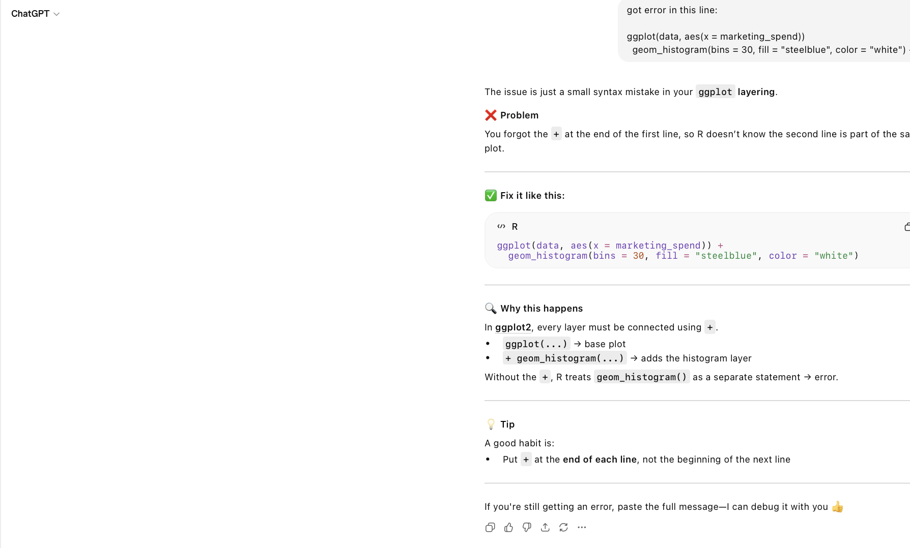
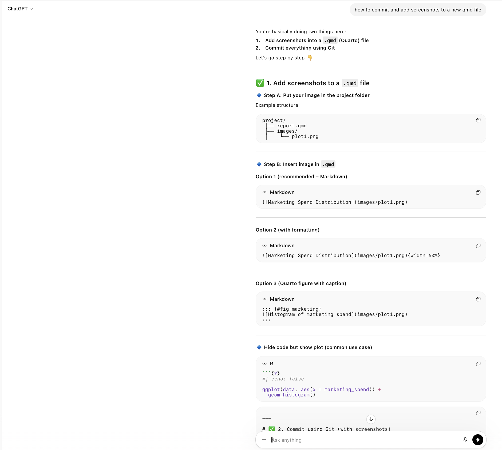

I used ChatGPT for assistance in R code debugging when getting errors and report format structure examples during the assignment.
All written analysis is done by me after referring the results which were shown after R code chunk execution.

## Screen shots of the chats:

